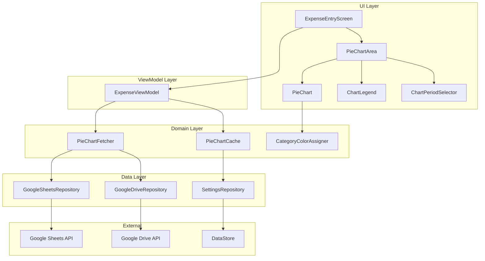

# Design Document: expense-pie-chart

## Overview

expense-pie-chart は、SpendMgr アプリの Expense_Entry_Screen 下部に円グラフ表示機能を追加する機能である。ユーザーは「今月」「今年」および過去年のいずれかの期間を選択し、その期間のカテゴリ別経費を色分けされた円グラフで視覚的に把握できる。

円グラフは Jetpack Compose の Canvas API を使用してドーナツグラフ形式で描画され、中央に合計金額を表示する。各カテゴリには決定論的に割り当てられた色が使用され、凡例には各カテゴリの色・名前・金額・割合が金額降順で表示される。

データは既存の Google スプレッドシートから取得し、カテゴリごとに集計する。キャッシュファーストの戦略を採用し、DataStore に永続化されたキャッシュを即座に表示してからバックグラウンドでスプレッドシートから最新データを取得する。経費記録・取り消し時はローカルでキャッシュを加減算し、API 呼び出しを最小化する。

期間セレクターは「xx年」プルダウンと「xx月/年間」プルダウンの2つで構成される。年と月が連動して期間を決定する。デフォルトは現在の年・現在の月。

## Architecture

### 全体構成



### 技術スタック

既存の SpendMgr アプリと同じ技術スタックを使用する：

| レイヤー | 技術 |
|---------|------|
| UI | Jetpack Compose + Material 3 + Canvas API |
| ViewModel | AndroidX ViewModel + StateFlow |
| DI | Hilt |
| 設定保存 | DataStore (Preferences) |
| API連携 | Google Sheets API v4, Google Drive API v3 |

## Components and Interfaces

### 1. UI Components

#### PieChartArea
円グラフ表示エリア全体を管理するコンポーネント。円グラフ本体、凡例、期間セレクター、家計立替表示を含む。認証状態やデータ取得状態に応じて適切なUIを表示する。

期間セレクタと家計立替は同じ `Row` に横並びで配置される（セレクタ左寄せ、家計立替右寄せ）。

```kotlin
@Composable
fun PieChartArea(
    pieChartData: PieChartData?,
    selectedPeriod: ChartPeriod,
    availableYears: List<Int>,
    isLoading: Boolean,
    isAuthenticated: Boolean,
    hasSpreadsheet: Boolean,
    onPeriodSelect: (ChartPeriod) -> Unit
)
```

#### PieChart
Canvas API を使用してドーナツグラフを描画するコンポーネント。各カテゴリを扇形セグメントとして描画し、中央に合計金額を表示する。スライスをタップすると拡大ハイライト＋フローティングラベルを表示し、他の部分をタップすると通常表示に戻る。

```kotlin
@Composable
fun PieChart(
    data: PieChartData,
    modifier: Modifier = Modifier
)
```

タップ動作：
- タップ判定は内周より内側（穴）を除いたエリアで有効。外周より外側も実用上タップ可能
- タップしたスライスを拡大（ストローク幅増加）＋外側にオフセット
- 他のスライスを半透明（alpha 0.3）に変更
- タップ位置の近くにフローティングカードでカテゴリ名・金額・割合を表示
- 内周より内側（穴）をタップすると選択解除
- 同じスライスを再タップすると選択解除
- 期間切り替え時は前のフェッチジョブをキャンセルして新しいジョブを起動（`pieChartFetchJob` で管理）

#### ChartLegend
各カテゴリの色・名前・金額・割合を金額降順で表示する凡例コンポーネント。

```kotlin
@Composable
fun ChartLegend(
    data: PieChartData,
    modifier: Modifier = Modifier
)
```

#### ChartPeriodSelector
「xx年」プルダウンと「xx月/年間」プルダウンの2つを横に並べたコンポーネント。年と月が連動して期間を決定する。

```kotlin
@Composable
fun ChartPeriodSelector(
    selectedPeriod: ChartPeriod,
    availableYears: List<Int>,  // 現在の年を含む全年リスト
    onPeriodSelect: (ChartPeriod) -> Unit,
    modifier: Modifier = Modifier
)
```

- 年プルダウン: `availableYears` の全年を表示（現在の年を含む）
- 月プルダウン: 1月〜12月 + 「年間」を表示
- 年を変更すると現在選択中の月を維持したまま年だけ変更
- 月を「年間」に変更すると `ChartPeriod.Yearly(selectedYear)` を返す
- デフォルト: 現在の年・現在の月

### 2. ViewModel

#### ExpenseViewModel (拡張)
既存の ExpenseViewModel に円グラフ関連の状態とロジックを追加する。

```kotlin
@HiltViewModel
class ExpenseViewModel @Inject constructor(
    // ... 既存の依存関係 ...
    private val pieChartFetcher: PieChartFetcher,
    private val pieChartCache: PieChartCache
) : ViewModel() {

    val uiState: StateFlow<ExpenseUiState>

    // 既存のメソッド...

    // 円グラフ関連の新規メソッド
    fun onPeriodSelect(period: ChartPeriod)
    fun fetchAvailableYears()
    
    // 経費記録成功時に円グラフキャッシュを更新
    private fun updatePieChartCacheOnRecord(expense: ExpenseRecord)
    
    // 経費取り消し成功時に円グラフキャッシュを更新
    private fun updatePieChartCacheOnUndo(expense: ExpenseRecord)
}
```

### 3. Domain Layer

#### PieChartFetcher
Google スプレッドシートから指定期間のカテゴリ別経費データを取得し、集計するモジュール。

```kotlin
class PieChartFetcher(
    private val googleSheetsRepository: GoogleSheetsRepository,
    private val googleDriveRepository: GoogleDriveRepository,
    private val settingsRepository: SettingsRepository,
    private val pieChartCache: PieChartCache
) {
    /**
     * 指定期間のカテゴリ別経費データを取得する。
     * まずキャッシュから即座に返し、バックグラウンドでスプレッドシートから最新データを取得してキャッシュを更新する。
     * 
     * @param period 取得する期間（MONTHLY, YEARLY, PAST_YEAR）
     * @return カテゴリ別経費データ。取得失敗時はnull
     */
    suspend fun fetchPieChartData(period: ChartPeriod): Result<PieChartData?>

    /**
     * Google Drive の SpendMgr フォルダ内に存在する Yearly_Spreadsheet の年のリストを取得する。
     * 現在の年は除外される。
     * 
     * @return 過去年のリスト（降順）。取得失敗時は空リスト
     */
    suspend fun fetchAvailableYears(): Result<List<Int>>

    /**
     * 指定年の全月シートからカテゴリ別経費データを集計する。
     * ヘッダー行（1行目）は除外される。
     */
    private suspend fun aggregateYearlyData(spreadsheetId: String): Map<String, Int>

    /**
     * 指定月シートからカテゴリ別経費データを集計する。
     * ヘッダー行（1行目）は除外される。
     */
    private suspend fun aggregateMonthlyData(spreadsheetId: String, sheetName: String): Map<String, Int>
}
```

#### PieChartCache
カテゴリ別経費データを DataStore に永続化するキャッシュ。Chart_Period をキーとして保持する。

```kotlin
class PieChartCache(
    private val settingsRepository: SettingsRepository
) {
    /**
     * 指定期間のキャッシュデータを取得する。
     * 
     * @param period 取得する期間
     * @return キャッシュされたデータ。未キャッシュの場合はnull
     */
    suspend fun get(period: ChartPeriod): PieChartData?

    /**
     * 指定期間のデータをキャッシュに保存し、DataStore に永続化する。
     * 
     * @param period 保存する期間
     * @param data 保存するデータ
     */
    suspend fun put(period: ChartPeriod, data: PieChartData)

    /**
     * 指定期間のキャッシュに経費を加算する。
     * 経費記録成功時に呼び出される。
     * カテゴリがキャッシュに存在しない場合（新カテゴリ）は新規エントリとして追加する。
     * キャッシュ自体が存在しない場合（未取得）は何もしない（次回バックグラウンド取得時に同期される）。
     * 
     * @param period 更新する期間
     * @param category カテゴリ名
     * @param amount 加算する金額
     */
    suspend fun addExpense(period: ChartPeriod, category: String, amount: Int)

    /**
     * 指定期間のキャッシュから経費を減算する。
     * 経費取り消し成功時に呼び出される。
     * カテゴリがキャッシュに存在しない場合は何もしない。
     * 減算後の金額が0以下になった場合はそのカテゴリをキャッシュから削除する。
     * キャッシュ自体が存在しない場合（未取得）は何もしない。
     * 
     * @param period 更新する期間
     * @param category カテゴリ名
     * @param amount 減算する金額
     */
    suspend fun removeExpense(period: ChartPeriod, category: String, amount: Int)

    /**
     * 全期間のキャッシュをクリアする。
     * プルトゥリフレッシュ時に呼び出される。
     */
    suspend fun clearAll()
}
```

#### CategoryColorAssigner
カテゴリ名から決定論的に色を割り当てるユーティリティ。

```kotlin
object CategoryColorAssigner {
    /**
     * カテゴリ名から決定論的に色を割り当てる。
     * 同じカテゴリ名には常に同じ色が返される。
     * 
     * @param category カテゴリ名
     * @return Material 3 カラーパレットからの色
     */
    fun colorFor(category: String): Color
}
```

### 4. Data Layer

#### GoogleSheetsRepository (拡張)
既存の GoogleSheetsRepository に新しいメソッドを追加する。

```kotlin
interface GoogleSheetsRepository {
    // ... 既存のメソッド ...

    suspend fun fetchCategoryAmounts(
        spreadsheetId: String,
        sheetName: String
    ): Result<List<Pair<String, Int>>>

    /**
     * 指定シートのカード払い（D列が TRUE または ○）の合計額を取得する。
     * ヘッダー行（1行目）は除外される。既存データでD列が空の行は集計から除外する。
     */
    suspend fun fetchCreditCardTotal(
        spreadsheetId: String,
        sheetName: String
    ): Result<Int?>
}
```

スプレッドシートへの書き込み仕様：
- `appendExpense()`: D列に `TRUE`/`FALSE` を `USER_ENTERED` で書き込む
- `createYearlySpreadsheet()`: 各月シートのD1に「カード払い」ヘッダーを設定し、D2:D1000 にチェックボックス入力規則（`BooleanCondition.type = "BOOLEAN"`）を設定する

#### GoogleDriveRepository (拡張)
既存の GoogleDriveRepository に新しいメソッドを追加する。

```kotlin
interface GoogleDriveRepository {
    // ... 既存のメソッド ...

    /**
     * 指定フォルダ内のスプレッドシート名のリストを取得する。
     * SpendMgr フォルダ内の年別スプレッドシート（例: "2025", "2024"）を列挙するために使用する。
     * 名前が4桁の数字のスプレッドシートのみを対象とする（年別スプレッドシートのフィルタリング）。
     * 
     * @param folderId フォルダID
     * @return スプレッドシート名のリスト（数字4桁のもののみ）
     */
    suspend fun listSpreadsheetNames(folderId: String): Result<List<String>>
}
```

#### SettingsRepository (拡張)
既存の SettingsRepository に円グラフキャッシュ・カード払い合計キャッシュ用のメソッドを追加する。

```kotlin
interface SettingsRepository {
    // ... 既存のメソッド ...

    suspend fun savePieChartCache(periodKey: String, data: String)
    suspend fun getPieChartCache(periodKey: String): String?
    suspend fun clearAllPieChartCache()

    // カード払い合計キャッシュ（periodKey をキーとして DataStore に保存）
    suspend fun saveCreditCardTotal(periodKey: String, total: Int?)
    suspend fun getCreditCardTotal(periodKey: String): Int?
}
```

## Data Models

### ChartPeriod
円グラフに表示するデータの期間を表す sealed class。

```kotlin
sealed class ChartPeriod {
    /**
     * 特定の年の特定の月
     * @param year 対象年
     * @param month 対象月（1〜12）
     */
    data class Monthly(val year: Int, val month: Int) : ChartPeriod()

    /**
     * 特定の年の年間合計
     * @param year 対象年
     */
    data class Yearly(val year: Int) : ChartPeriod()

    /**
     * DataStore のキーとして使用する文字列を返す。
     */
    fun toKey(): String = when (this) {
        is Monthly -> "MONTHLY_${year}_${month}"
        is Yearly -> "YEARLY_$year"
    }
}
```

### PieChartData
円グラフ描画に必要なデータ。

`CategoryData` から `color` フィールドを除いて DataStore に JSON 保存し、復元時に `CategoryColorAssigner.colorFor(name)` で色を再計算する。これにより Compose の `Color` 型を JSON シリアライズする問題を回避する。

```kotlin
data class PieChartData(
    val categories: List<CategoryData>,
    val totalAmount: Int,
    val creditCardTotal: Int? = null  // カード払い合計（家計立替）。null = データなし
) {
    fun toJson(): String  // creditCardTotal も JSON に含める
    companion object {
        fun fromJson(json: String): PieChartData?
    }
}

data class CategoryData(
    val name: String,
    val amount: Int,
    val percentage: Float,
    val color: Color
)
```

### ExpenseUiState (拡張)
既存の ExpenseUiState に円グラフ関連・クレカフラグのフィールドを追加する。

```kotlin
data class ExpenseUiState(
    // ... 既存のフィールド ...
    val isCreditCard: Boolean = true,   // クレジットカード払いか否か（デフォルト: カード払い）

    // 円グラフ関連の新規フィールド
    val pieChartData: PieChartData? = null,
    val selectedPeriod: ChartPeriod = ChartPeriod.Monthly,
    val availableYears: List<Int> = emptyList(),
    val isPieChartLoading: Boolean = false
)
```

## Correctness Properties

*プロパティとは、システムのすべての有効な実行において成立すべき特性や振る舞いのことである。人間が読める仕様と、機械で検証可能な正しさの保証をつなぐ橋渡しとなる。*

### Property Reflection

プロパティ分析の結果、以下のプロパティを特定した：

**統合可能なプロパティ:**
- Property 5.1（経費追加時のキャッシュ加算）と Property 5.2（経費取り消し時のキャッシュ減算）は、ラウンドトリッププロパティとして統合できる
- Property 4.2（年次集計）と Property 4.3（月次集計）は、データ集計の正確性という観点で統合できる

**冗長なプロパティ:**
- Property 4.4（ヘッダー行除外）は Property 4.2/4.3 の集計プロパティに含まれるため、独立したプロパティとしては不要

以下、統合・整理後のプロパティを記載する。

### Property 1: カテゴリ色割り当ての決定論性

*For any* カテゴリ名文字列に対して、`CategoryColorAssigner.colorFor()` を複数回呼び出すと、常に同じ色が返される。

**Validates: Requirements 3.2**

### Property 2: カテゴリ色のパレット制約

*For any* カテゴリ名文字列に対して、`CategoryColorAssigner.colorFor()` が返す色は、事前定義された Material 3 カラーパレットのいずれかである。

**Validates: Requirements 3.3**

### Property 3: 凡例表示の完全性

*For any* PieChartData に対して、ChartLegend が描画する各凡例項目は、カテゴリ名、色、「¥」プレフィックス付きカンマ区切り金額、小数点第1位までのパーセンテージを含む。

**Validates: Requirements 3.4**

### Property 4: データ集計の正確性

*For any* スプレッドシートの経費データ（複数シートまたは単一シート）に対して、`PieChartFetcher` が返すカテゴリ別合計金額は、ヘッダー行（1行目）を除いた全データ行をカテゴリごとにグループ化して合計した値と一致する。

**Validates: Requirements 4.2, 4.3, 4.4**

### Property 5: キャッシュの永続化ラウンドトリップ

*For any* PieChartData と ChartPeriod に対して、`PieChartCache.put()` で保存した後に `PieChartCache.get()` で取得すると、元のデータと等価なデータが返される（カテゴリ名、金額、割合が一致）。

**Validates: Requirements 4.5**

### Property 6: 経費記録・取り消しのラウンドトリップ

*For any* 初期 PieChartData、ChartPeriod、カテゴリ名、金額に対して、`PieChartCache.addExpense()` で経費を加算した後に `PieChartCache.removeExpense()` で同じ経費を減算すると、キャッシュは元の状態に戻る（各カテゴリの金額が元の値と一致）。

**Validates: Requirements 5.1, 5.2**

### Property 7: 円グラフスライス面積の比例性

*For any* PieChartData に対して、各 CategorySlice の掃引角度（sweep angle）は、そのカテゴリの金額が全体の合計金額に占める割合に 360 度を乗じた値と一致する（誤差 ±0.1 度以内）。

**Validates: Requirements 7.2**

### Property 8: 合計金額フォーマットの正確性

*For any* 非負整数の金額に対して、円グラフ中央に表示される合計金額文字列は「¥」プレフィックスと3桁ごとのカンマ区切りを含む（例: ¥1,234,567）。

**Validates: Requirements 7.3**

### Property 9: 凡例のソート順

*For any* PieChartData に対して、ChartLegend に表示されるカテゴリは金額の降順でソートされている（i 番目のカテゴリの金額 ≥ i+1 番目のカテゴリの金額）。

**Validates: Requirements 7.4**

### Property 10: 過去年フィルタリングの正確性

*For any* 年のリスト（Available_Years の候補）に対して、ChartPeriodSelector に表示される過去年リストは、現在の年を除外したリストと一致する。

**Validates: Requirements 2.3**

### Property 11: 期間選択とデータ対応

*For any* 選択された ChartPeriod に対して、PieChartArea に表示される PieChartData は、その期間に対応するスプレッドシートデータから集計されたものである（期間が MONTHLY なら今月のシート、YEARLY なら今年の全シート、PAST_YEAR(year) なら指定年の全シート）。

**Validates: Requirements 2.5**

## Error Handling

### エラー分類と対応

| エラー種別 | 発生条件 | 対応 |
|-----------|---------|------|
| 未認証エラー | OAuth認証未完了 | 「Googleアカウントを連携してください」メッセージ表示 |
| スプレッドシート未存在エラー | 対応する Yearly_Spreadsheet が存在しない | 「データがありません」メッセージ表示 |
| データ取得エラー | Google Sheets API への接続失敗 | 「データの取得に失敗しました」メッセージ表示、キャッシュデータは保持 |
| 空データエラー | 選択期間のデータが0件 | 「この期間の経費データがありません」メッセージ表示 |
| Available_Years 取得エラー | Google Drive API への接続失敗 | 「今月」「今年」のみ表示、過去年は非表示 |

### キャッシュファースト戦略

データ取得の処理フロー：
1. まず `PieChartCache.get()` でキャッシュから即座にデータを取得して表示
2. キャッシュがない場合は即座に `isPieChartLoading = true` にしてローディングスピナーを表示
3. バックグラウンドで `PieChartFetcher.fetchPieChartData()` を呼び出してスプレッドシートから最新データを取得
4. 取得成功時：`PieChartCache.put()` でキャッシュを更新し、UI を再描画
5. 取得失敗時：キャッシュデータをそのまま表示し続け、エラーメッセージを表示

期間切り替え時は前のフェッチジョブをキャンセルして新しいジョブを起動する（`pieChartFetchJob` で管理）。

再インストール後（DataStore クリア後）はフォルダID・スプレッドシートIDのキャッシュがないため、Drive API で直接 `SpendMgr` フォルダを検索してIDを取得・保存する。

### 経費記録・取り消し時のキャッシュ更新

記録成功時：
1. 記録した経費の日付が今月の場合のみ `PieChartCache.addExpense(ChartPeriod.Monthly, ...)` を呼び出す
2. 記録した経費の日付が今年の場合のみ `PieChartCache.addExpense(ChartPeriod.Yearly, ...)` を呼び出す
3. `summaryCache.adjust()` も今年のデータのみ更新する
4. スプレッドシートへの API 呼び出しは行わない

取り消し成功時：
1. 取り消した経費の日付が今月の場合のみ `PieChartCache.removeExpense(ChartPeriod.Monthly, ...)` を呼び出す
2. 取り消した経費の日付が今年の場合のみ `PieChartCache.removeExpense(ChartPeriod.Yearly, ...)` を呼び出す
3. `summaryCache.adjust()` も今年のデータのみ更新する
4. スプレッドシートへの API 呼び出しは行わない

プルトゥリフレッシュ時：
1. `PieChartCache.clearAll()` で全キャッシュをクリア
2. 現在選択中の期間のデータをスプレッドシートから再取得

## Testing Strategy

### テストフレームワーク

| テスト種別 | フレームワーク |
|-----------|--------------|
| ユニットテスト | JUnit 5 + MockK |
| プロパティベーステスト | Kotest (Property-Based Testing) |
| UIテスト | Compose UI Test |
| インテグレーションテスト | JUnit 5 + MockK |

### プロパティベーステスト

KotestのプロパティベーステストAPIを使用し、各プロパティを最低100イテレーションで実行する。

各テストには以下の形式でタグを付与する：
```kotlin
// Feature: expense-pie-chart, Property {number}: {property_text}
```

対象プロパティ：
- Property 1: カテゴリ色割り当ての決定論性（Arb.string() でカテゴリ名を生成、同じ入力に対して同じ色が返ることを検証）
- Property 2: カテゴリ色のパレット制約（Arb.string() でカテゴリ名を生成、返される色が事前定義パレットに含まれることを検証）
- Property 3: 凡例表示の完全性（Arb.list() で CategoryData を生成、描画された凡例に全必須フィールドが含まれることを検証）
- Property 4: データ集計の正確性（Arb.list() で経費データを生成、集計結果が手動計算と一致することを検証）
- Property 5: キャッシュの永続化ラウンドトリップ（Arb.list() で PieChartData を生成、put → get のラウンドトリップを検証）
- Property 6: 経費記録・取り消しのラウンドトリップ（Arb.int() で金額、Arb.string() でカテゴリを生成、addExpense → removeExpense のラウンドトリップを検証）
- Property 7: 円グラフスライス面積の比例性（Arb.list() で CategoryData を生成、各スライスの掃引角度が比例することを検証）
- Property 8: 合計金額フォーマットの正確性（Arb.int(0..Int.MAX_VALUE) で金額を生成、フォーマット結果が正規表現 `¥\d{1,3}(,\d{3})*` にマッチすることを検証）
- Property 9: 凡例のソート順（Arb.list() で CategoryData を生成、凡例が金額降順でソートされることを検証）
- Property 10: 過去年フィルタリングの正確性（Arb.list(Arb.int(2020..2030)) で年リストを生成、現在年が除外されることを検証）
- Property 11: 期間選択とデータ対応（Arb.choice(ChartPeriod.Monthly, ChartPeriod.Yearly, ChartPeriod.PastYear(2024)) で期間を生成、表示データが期間に対応することを検証）

### ユニットテスト（例ベース）

- PieChartArea: 認証未完了時に「Googleアカウントを連携してください」メッセージが表示されること（Req 1.4）
- PieChartArea: スプレッドシート未存在時に「データがありません」メッセージが表示されること（Req 1.5）
- PieChartArea: PieChart、ChartLegend、ChartPeriodSelector が含まれること（Req 1.2）
- ChartPeriodSelector: 起動時に「今月」が初期選択されること（Req 2.4）
- ChartPeriodSelector: 選択中の期間が視覚的に区別されること（Req 2.6）
- ChartPeriodSelector: Available_Years 取得失敗時に「今月」「今年」のみ表示されること（Req 2.7）
- PieChartFetcher: キャッシュから即座にデータを返し、バックグラウンドで最新データを取得すること（Req 4.1）
- PieChartFetcher: 期間切り替え時にキャッシュを即座に表示すること（Req 4.6）
- PieChartCache: プルトゥリフレッシュ時に全キャッシュがクリアされること（Req 5.3）
- PieChartArea: データ取得中にローディングインジケーターが表示されること（Req 6.1）
- PieChartArea: API 呼び出し失敗時に「データの取得に失敗しました」メッセージが表示されること（Req 6.2）
- PieChartArea: データ0件時に「この期間の経費データがありません」メッセージが表示されること（Req 6.3）
- PieChart: カテゴリ数が1件以上の場合に扇形セグメントが描画されること（Req 7.1）

### インテグレーションテスト

- GoogleSheetsRepository: モックサーバーを使用してカテゴリ・金額データの取得を検証（Req 4.2, 4.3）
- GoogleDriveRepository: モックサーバーを使用してスプレッドシート名リストの取得を検証（Req 2.2）
- PieChartCache: DataStore への永続化と復元を検証（Req 4.5）
